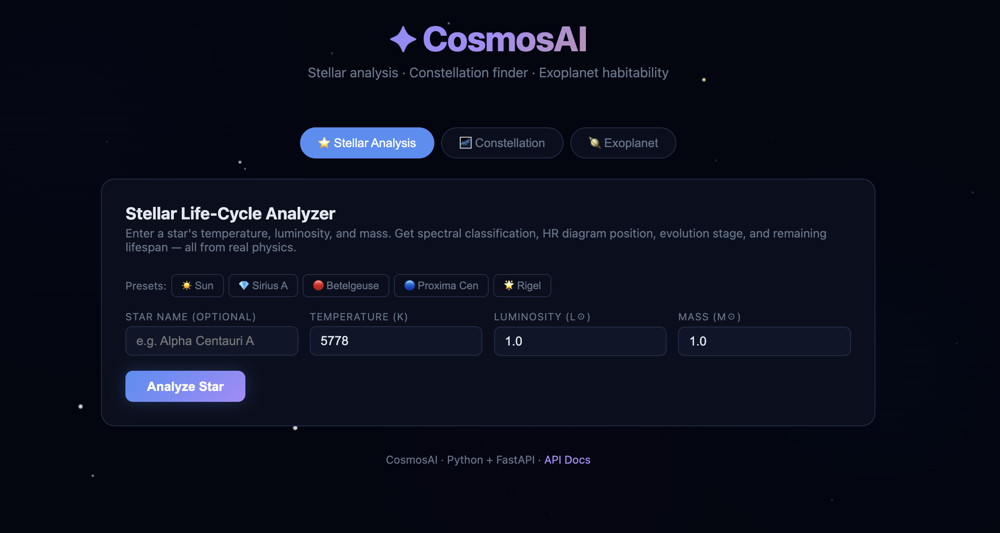
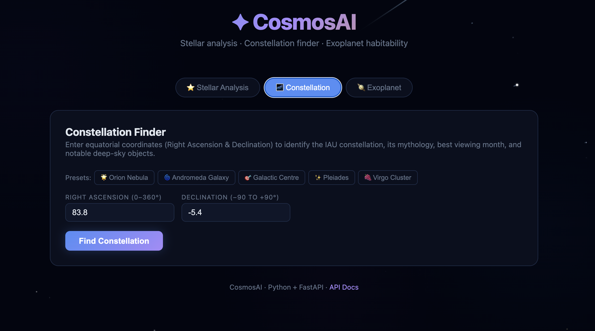
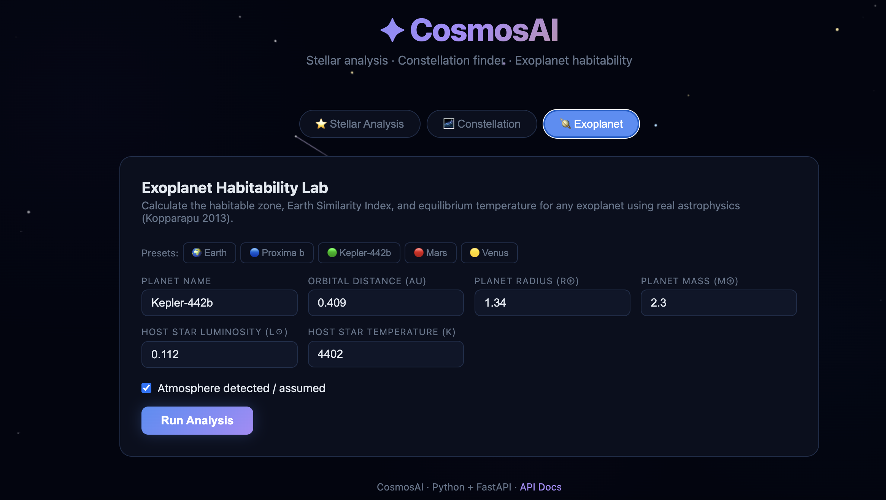

# ✦ CosmosAI — Astronomy Analysis Platform

A Python + FastAPI astronomy platform built for exploring the cosmos.

## Features

| | Feature | What it does |
|---|---|---|
| ⭐ | **Stellar Analyzer** | Input temperature / luminosity / mass → spectral class, HR diagram position, evolution stage, lifetime |
| 🌌 | **Constellation Finder** | Input RA/Dec → IAU constellation, mythology, best viewing month, deep-sky objects |
| 🪐 | **Exoplanet Habitability** | Input planet params → habitable zone, ESI score, equilibrium temperature, habitability score 0–100 |

## Quickstart

```bash
git clone https://github.com/anway287/cosmos-ai.git
cd cosmos-ai

python3 -m venv venv
source venv/bin/activate       # Windows: venv\Scripts\activate
pip install -r requirements.txt

uvicorn app.main:app --reload
# → open http://localhost:8000
```

API docs at **http://localhost:8000/docs**

## Physics Used

| Formula | What it calculates |
|---|---|
| `R = R☉ √(L/L☉) (T☉/T)²` | Stellar radius (Stefan-Boltzmann) |
| `τ = (M/L) × 10 Gyr` | Main-sequence lifetime |
| `T_eq = 278.5 × L^0.25 / d^0.5 × (1-A)^0.25` | Exoplanet equilibrium temperature |
| `HZ = [0.99√L, 1.70√L] AU` | Kopparapu (2013) habitable zone |
| `ESI = ∏(1 - \|xi−xi⊕\| / (xi+xi⊕))^wi` | Earth Similarity Index |

## Tech Stack

- **FastAPI** — async Python API
- **Pydantic v2** — request/response validation
- **Vanilla HTML/CSS/JS** — dark space-themed UI

## 📸 UI Preview

### ⭐ Stellar Life-Cycle Analyzer
Analyze stars using temperature, luminosity, and mass to determine spectral class, HR diagram position, evolution stage, and lifespan.

<p align="center">
  
</p>

---

### 🌌 Constellation Finder
Identify constellations using Right Ascension and Declination, along with mythology, best viewing time, and nearby deep-sky objects.

<p align="center">
  
</p>

---

### 🪐 Exoplanet Habitability Lab
Evaluate whether a planet can support life using habitable zone calculations, Earth Similarity Index, and equilibrium temperature.

<p align="center">
  
</p>